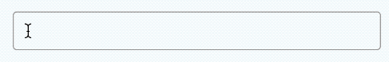

# Aurelia tags input

### An Aurelia tags input plugin


  <br/>


### Install

`npm install aurelia-tags-input --save`

### Use
  
```javascript
  export async function configure(aurelia) {
    //...
    aurelia.use
      //..
      .plugin('aurelia-tags-input')
  }
```

```html
<aurelia-tags-input
  tags.bind="tags"
  on-change.bind="onTagsChanged">
</aurelia-tags-input>
```

## Optional bindable props
- ```tags``` - array of string to render on the input as tags
- ```on-change``` - callback function called when tags are changed

## Building The Code

To build the code, follow these steps.

1. Ensure that [NodeJS](http://nodejs.org/) is installed. This provides the platform on which the build tooling runs.
2. From the project folder, execute the following command:

  ```shell
  npm install
  ```
3. Ensure that [Gulp](http://gulpjs.com/) is installed. If you need to install it, use the following command:

  ```shell
  npm install -g gulp
  ```
4. To build the code, you can now run:

  ```shell
  gulp build
  ```
5. You will find the compiled code in the `dist` folder, available in three module formats: AMD, CommonJS and ES6.

6. See `gulpfile.js` for other tasks related to generating the docs and linting.

## Running The Tests

To run the unit tests, first ensure that you have followed the steps above in order to install all dependencies and successfully build the library. Once you have done that, proceed with these additional steps:

1. Ensure that the [Karma](http://karma-runner.github.io/) CLI is installed. If you need to install it, use the following command:

  ```shell
  npm install -g karma-cli
  ```
2. Ensure that [jspm](http://jspm.io/) is installed. If you need to install it, use the following commnand:

  ```shell
  npm install -g jspm
  ```
3. Install the client-side dependencies with jspm:

  ```shell
  jspm install
  ```

4. You can now run the tests with this command:

  ```shell
  karma start
  ```
